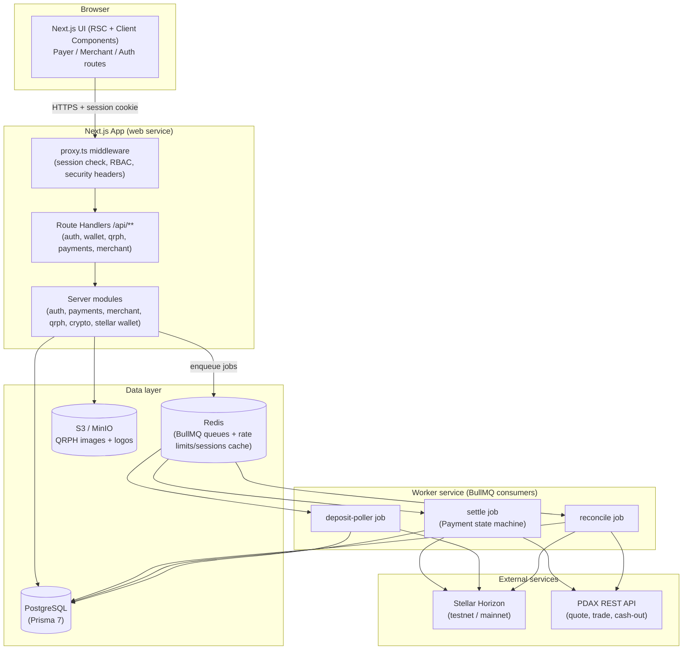
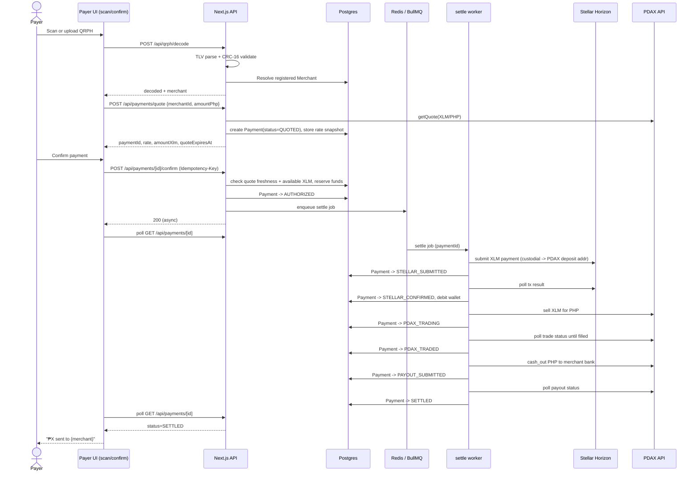
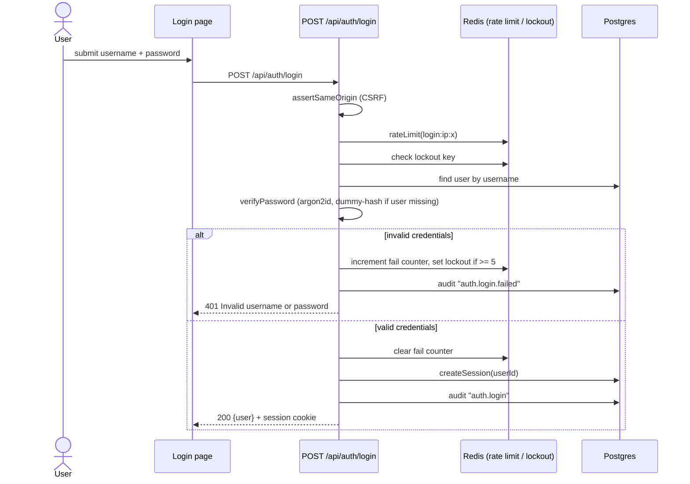
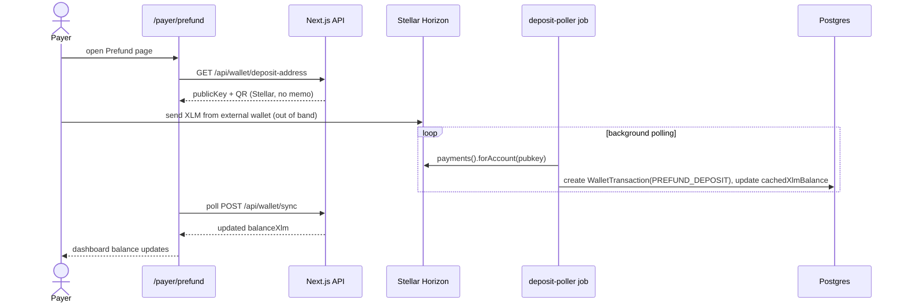

# HeyPay

> Pay any QRPH merchant in the Philippines straight from your Stellar (XLM) balance.

HeyPay lets a **Payer** prefund a custodial Stellar wallet with XLM, scan an existing **QRPH** merchant code, and pay — HeyPay converts the XLM to PHP via the PDAX exchange and settles the PHP directly into the **Merchant's** bank account. The hero flow: scan QRPH → confirm the live XLM→PHP quote → HeyPay moves XLM on Stellar, sells it for PHP on PDAX, and pays out to the merchant's bank, with the payer watching a live status overlay the whole way.

## Status / License

|         |                                                                                                                                                                                                                                        |
| ------- | -------------------------------------------------------------------------------------------------------------------------------------------------------------------------------------------------------------------------------------- |
| Version | `0.1.0` (`package.json`)                                                                                                                                                                                                               |
| Status  | Active development — payer, merchant, and auth surfaces implemented; admin UI, e2e tests, and production PDAX wiring not yet complete [inferred from `docs/features.md` and missing `src/app/(admin)`/`src/app/api/admin` directories] |
| License | Not specified — no `LICENSE` file in the repo                                                                                                                                                                                          |

## Problem

Philippine merchants overwhelmingly accept payment through **QRPH**, the BSP's EMVCo-based national QR standard tied to PHP bank accounts (SPEC.md §1). Meanwhile, someone holding **XLM** has no direct way to pay at those merchants — they would need to off-ramp to PHP through a separate exchange before they could pay anyone. HeyPay closes that gap: it is a custodial bridge that lets a payer spend XLM at any merchant who already accepts QRPH, with no merchant-side integration work required (SPEC.md §1, "Happy path").

## Vision / Purpose

Per `SPEC.md`, HeyPay's v1 scope is a **web-only demo/MVP**: custodial Stellar wallets, PDAX-mediated XLM→PHP conversion, and PHP cash-out to a merchant's registered bank account, with `MOCK` and `PDAX` (staging) provider modes so the full flow can be demonstrated without real money movement (SPEC.md §1 "Explicitly out of scope"). The long-term intent (per SPEC.md §1) is a foundation that can later add USDT/USDC as payment assets, real KYC/AML/OTP flows, and mobile apps — all currently stubbed or explicitly deferred. `AGENT.md`/`auto-dev.md` and the `docs/superpowers/plans` directory show the project being built sprint-by-sprint by an AI coding agent against a fixed spec [inferred].

## Target Users

- **Payers** — XLM holders who want to spend crypto at everyday PH merchants without manually off-ramping first.
- **Merchants** — PH businesses that already accept QRPH and want to receive PHP from crypto-holding customers with zero extra integration (they just register their existing QR + bank account).
- **Admins** _(spec'd, not yet built)_ — operators who need visibility into users, merchants, and payment health (SPEC.md §2, §5).

## Features

Implemented (grounded in `src/`):

**Auth & accounts**

- Username/password signup and login with argon2id hashing, timing-safe dummy-hash comparison, IP + username rate limiting and lockout, and server-side sessions (`src/app/api/auth/*`, `src/server/auth/*`).
- CSRF protection via same-origin checks on all mutating routes (`src/server/auth/csrf.ts`) and role-based route access enforced in `src/proxy.ts` (Next.js middleware).
- Audit logging of security-relevant actions (`src/server/auth/audit.ts`).

**Payer**

- Custodial Stellar wallet per payer, generated and envelope-encrypted at signup (`src/server/stellar/wallet.ts`, `src/server/crypto/envelope.ts` — AES-256-GCM).
- Prefund flow: deposit address + QR, background deposit detection (`src/app/(payer)/payer/prefund`, `src/server/queue/jobs/deposit-poller.ts`).
- QRPH scanning via camera (`getUserMedia` + `jsQR`) or image upload, decoded server-side with a real EMVCo TLV parser and CRC-16 validation (`src/server/qrph/{tlv,crc,decode,resolve}.ts`).
- Live rate quoting with a TTL-bound rate lock, funds-sufficiency checks, and idempotent payment confirmation (`src/server/payments/{quote,confirm,idempotency}.ts`).
- A `Payment` state machine (`CREATED → … → SETTLED/FAILED/REFUNDED`) driven asynchronously by a BullMQ worker, with a live-polling processing overlay in the UI (`src/server/payments/state-machine.ts`, `src/server/queue/jobs/settle.ts`, `src/app/(payer)/payer/pay/[paymentId]/confirm`).
- Personal transaction history with a detail drawer showing the full `PaymentEvent` timeline (`src/app/(payer)/payer/transactions`).
- Dashboard with live-polled balance, recent payments, and a network-status indicator (`src/app/(payer)/payer/dashboard`).

**Merchant**

- 4-step onboarding wizard (business identity → settlement bank → QRPH link → review/go-live) with a live payer-facing preview pane (`src/app/(merchant)/merchant/onboarding`, `src/components/merchant/onboarding/*`).
- Bank-account validation against a supported-bank list, with the account number envelope-encrypted at rest and only a masked last-4 exposed (`src/server/merchant/banks.ts`, `src/app/api/merchant/settlement`).
- QRPH upload/link with CRC validation and cross-merchant uniqueness enforcement (`src/app/api/merchant/qrph`).
- Go-live completeness gate (`ACTIVE` or `PENDING_REVIEW` behind a `MERCHANT_REVIEW_GATE` flag) (`src/app/api/merchant/go-live`).
- Dashboard with earnings (total settled PHP, month-over-month change), pending XLM trades, and a business transactions table (`src/app/(merchant)/merchant/dashboard`).
- Business QR rendering (SVG) and shareable payment link (`src/app/api/merchant/qr`).

**Platform / infra**

- `PaymentRailProvider` abstraction with a deterministic `MockProvider` and a `PdaxProvider` for real PDAX integration, switched via `PAYMENT_RAIL` (`src/server/rails/{provider,mock,pdax,index}.ts`).
- BullMQ-driven worker process running the settlement state machine, deposit poller, and a balance-reconciliation job (`src/worker/index.ts`, `src/server/queue/*`).
- S3-compatible object storage client (MinIO locally, S3-compatible in prod) for QRPH images and merchant logos (`src/server/storage/s3.ts`).
- Security headers applied to every response (`src/lib/security-headers.ts`, wired through `proxy.ts`).

Spec'd but **not yet implemented** in the codebase [inferred: absent directories]:

- Admin surfaces (`/admin/*`, `/api/admin/*`) — SPEC.md §5/§6 describes these; no corresponding routes exist yet.
- File upload presign endpoint (`/api/uploads/presign`) and PDAX webhook receiver (`/api/webhooks/pdax`) — described in SPEC.md §6 but not found under `src/app/api`.
- Playwright end-to-end tests — explicitly deferred to "Sprint 9" per `docs/features.md` and commented out in `.github/workflows/ci.yml`.
- USDT/USDC payment assets — modeled in the Prisma `PaymentAsset` enum but gated off (only `XLM` is active).

## Architecture



## Sequence diagrams

### 1. Pay a merchant (hero flow)



### 2. Login (auth flow)



### 3. Prefund + async deposit detection



## Smart Contracts

No Soroban contract crates were found in this repository (no `Cargo.toml` / `*.rs` files under version control as of this commit). Stellar interaction is currently limited to classic Horizon payment operations via `@stellar/stellar-sdk` (`src/server/stellar/wallet.ts`, `src/server/stellar/horizon.ts`) — there is no on-chain contract layer yet.

<!-- PLACEHOLDER: Soroban smart contracts — document each contract's purpose, public functions, parameters, and deployment/upload process here. -->

## Tech Stack

**Frontend**

- Next.js `^16.2.9` (App Router, RSC + Client Components), React `^19.2.7`
- Tailwind CSS `^4.3.1` (`@tailwindcss/postcss`)
- `clsx` for conditional class composition
- `jsqr` for client-side QR decoding (camera/upload)

**Backend / API**

- Next.js Route Handlers (`src/app/api/**`) + Server Actions
- Zod `^4.4.3` for input validation
- `decimal.js` for precise monetary math (no floats)
- `argon2` for password hashing
- `sodium-native` for cryptographic signing operations
- `qrcode` for server-side QR SVG rendering

**Database / queue**

- PostgreSQL via Prisma `^7.8.0` (`@prisma/client`, `@prisma/adapter-pg`, `pg`)
- Redis via `ioredis`, backing **BullMQ** `^5.79.2` job queues (settlement, deposit polling, reconciliation)

**Blockchain**

- `@stellar/stellar-sdk` `^16.0.1` against Horizon (testnet in dev, per `.env.example`)

**Payment rail integration**

- Custom `PaymentRailProvider` abstraction with `MockProvider` (deterministic, local dev) and `PdaxProvider` (real PDAX REST API, HMAC-signed)

**Object storage**

- AWS SDK v3 (`@aws-sdk/client-s3`, `s3-presigned-post`, `s3-request-presigner`) against MinIO (dev) or an S3-compatible bucket (prod)
- `sharp` for image processing

**Infra / local dev**

- Docker Compose (`docker-compose.yml`): Postgres 17, Redis 7, MinIO
- `pnpm` `10.33.0` workspace, Node `>=22`

**Testing / quality**

- Vitest `^4.1.9` + Testing Library (`@testing-library/react`, `@testing-library/dom`) + `jsdom`
- ESLint `^10.6.0` + `typescript-eslint`, Prettier `^3.9.1`
- TypeScript `^6.0.3`

**CI**

- GitHub Actions (`.github/workflows/ci.yml`): install → Prisma generate/migrate → typecheck → lint → format check → `pnpm audit --prod` → unit/integration tests (Vitest) → build. Playwright e2e is present in the workflow only as a commented-out placeholder, deferred to a later sprint.

## How to Run Locally

Required tooling: **Node ≥22**, **pnpm 10.33.0** (`packageManager` field — use `corepack enable` or install directly), and **Docker** (for local Postgres/Redis/MinIO).

1. **Clone and install dependencies**

   ```bash
   git clone <repo-url>
   cd heypay
   pnpm install
   ```

2. **Start local infrastructure** (Postgres, Redis, MinIO)

   ```bash
   docker compose up -d
   ```

3. **Configure environment variables**

   ```bash
   cp .env.example .env
   ```

   Then edit `.env`. Variable groups and whether they're required:

   | Variable                                                                                          | Required?                           | Notes                                                                                                                    |
   | ------------------------------------------------------------------------------------------------- | ----------------------------------- | ------------------------------------------------------------------------------------------------------------------------ |
   | `DATABASE_URL`, `SHADOW_DATABASE_URL`                                                             | **Required**                        | Must point at the Postgres started above (or your own instance).                                                         |
   | `REDIS_URL`                                                                                       | **Required**                        | BullMQ + rate limiting/session cache.                                                                                    |
   | `SESSION_SECRET`, `ENCRYPTION_MASTER_KEY`, `ENCRYPTION_KEY_VERSION`                               | **Required**                        | Session signing + AES-256-GCM envelope encryption for wallet secrets and bank account numbers. Never commit real values. |
   | `ADMIN_USERNAME`, `ADMIN_PASSWORD`                                                                | **Required** for seeding            | Consumed by `prisma/seed.ts` to create the seeded admin user (idempotent upsert).                                        |
   | `SEED_DEMO`                                                                                       | Optional                            | `true` also seeds a demo payer (testnet-funded wallet) and demo merchant so the flows work immediately.                  |
   | `STELLAR_NETWORK`, `STELLAR_HORIZON_URL`, `STELLAR_NETWORK_PASSPHRASE`                            | **Required**                        | Defaults in `.env.example` point at Stellar **testnet**.                                                                 |
   | `PAYMENT_RAIL`                                                                                    | **Required**                        | `mock` (default, deterministic local rail) or `pdax` (real PDAX API).                                                    |
   | `PDAX_BASE_URL`, `PDAX_ACCESS_KEY`, `PDAX_SECRET`, `PDAX_TOTP_SECRET`, `PDAX_XLM_DEPOSIT_ADDRESS` | Optional unless `PAYMENT_RAIL=pdax` | Only needed to exercise the real PDAX integration.                                                                       |
   | `S3_ENDPOINT`, `S3_REGION`, `S3_BUCKET`, `S3_ACCESS_KEY`, `S3_SECRET_KEY`, `S3_FORCE_PATH_STYLE`  | **Required**                        | Defaults target the local MinIO container.                                                                               |
   | `APP_URL`                                                                                         | **Required**                        | Used for same-origin/CSRF checks and absolute links.                                                                     |

4. **Run database migrations and seed data**

   ```bash
   pnpm prisma migrate deploy
   pnpm prisma db seed
   ```

5. **Start the web app**

   ```bash
   pnpm dev
   ```

   App runs at `http://localhost:3000` (or `APP_URL`).

6. **Start the background worker** (separate terminal — required for prefund detection and payment settlement to progress)

   ```bash
   pnpm worker:dev
   ```

7. **Optional: run the quality gate locally**
   ```bash
   pnpm typecheck
   pnpm lint
   pnpm format:check
   pnpm test
   pnpm build
   ```

## Deployment

`SPEC.md` §7.4 designates **Railway** as the target infrastructure: a `web` service (Next.js) and a `worker` service (BullMQ consumers) from the same repo/shared env group, with managed Postgres and Redis plugins and either a Railway volume or S3-compatible bucket for object storage; `prisma migrate deploy` runs on release. No Railway config files (e.g. `railway.json`/`railway.toml`) were found in the repo at this commit — deployment wiring is described in the spec but not yet checked in [inferred].

CI (`.github/workflows/ci.yml`) runs on pushes to `main` and on pull requests, gating on typecheck/lint/format/audit/tests/build; it does not itself deploy.

- Live app URL: `[PLACEHOLDER: Live app URL]`
- Web service: `[PLACEHOLDER: Railway web service URL]`
- Worker service: `[PLACEHOLDER: Railway worker service URL]`

## Demo

- Live app: `[PLACEHOLDER: Live app URL]`
- Demo video: `[PLACEHOLDER: Demo video URL]`
- Screenshot: `[PLACEHOLDER: screenshot]`

## Team

| Name                  | Role                  | Contact                  |
| --------------------- | --------------------- | ------------------------ |
| `[PLACEHOLDER: name]` | `[PLACEHOLDER: role]` | `[PLACEHOLDER: contact]` |
| `[PLACEHOLDER: name]` | `[PLACEHOLDER: role]` | `[PLACEHOLDER: contact]` |

## License

No `LICENSE` file is present in this repository — license terms are undetermined. `[PLACEHOLDER: License]`
