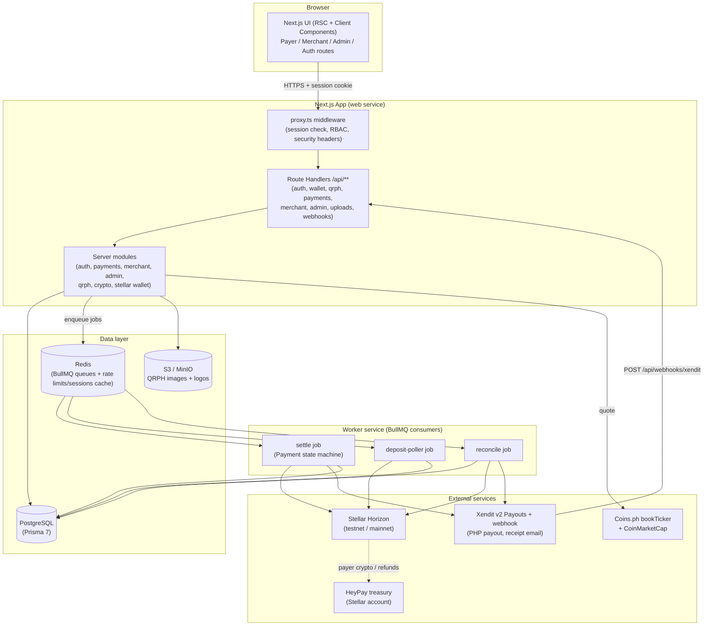
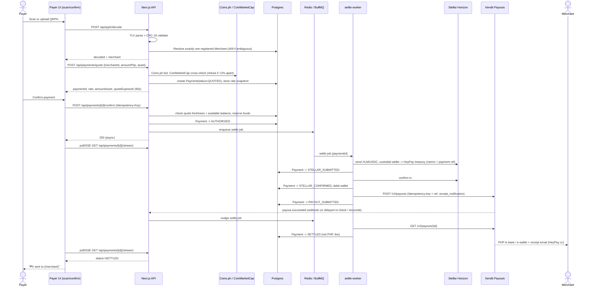
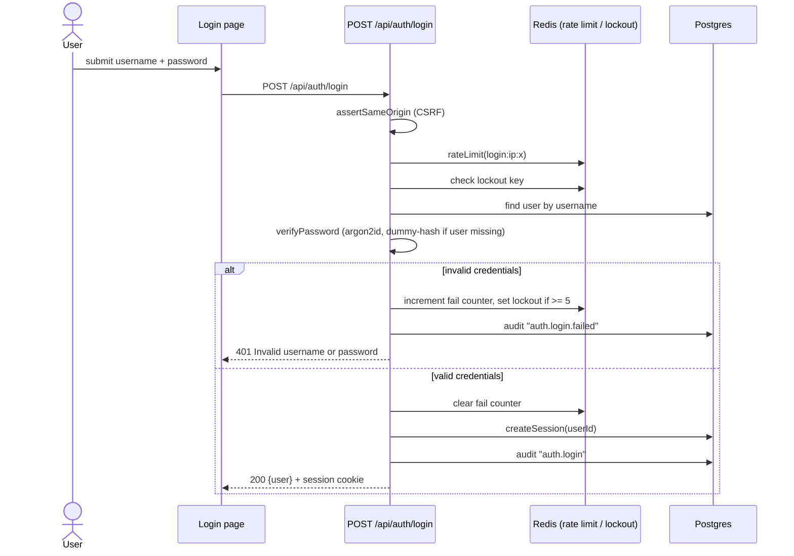
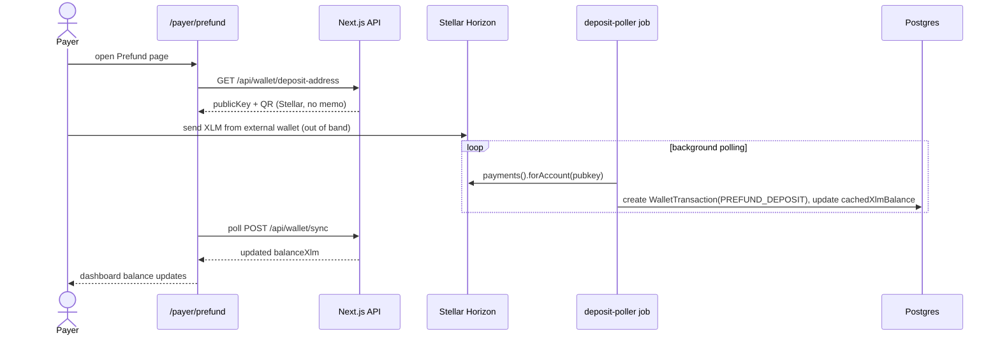
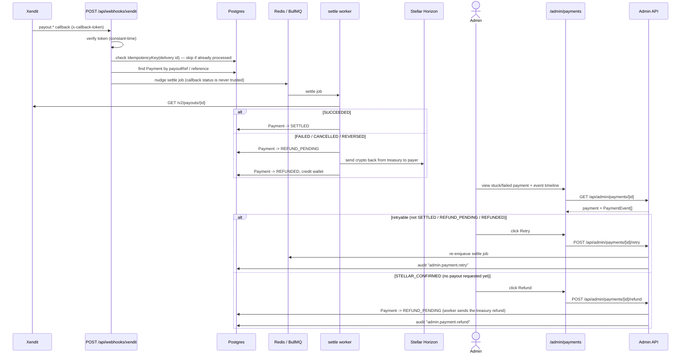
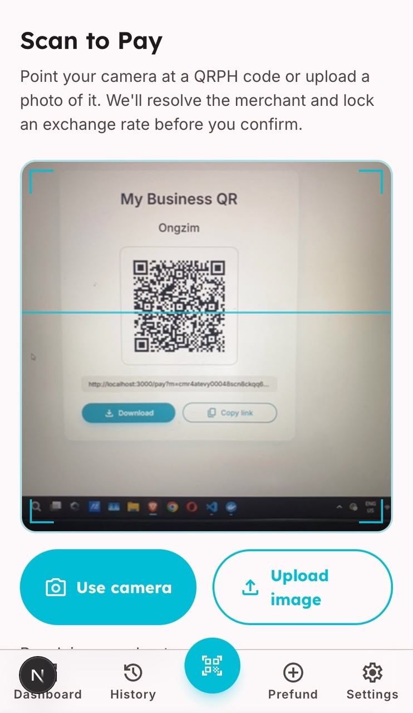
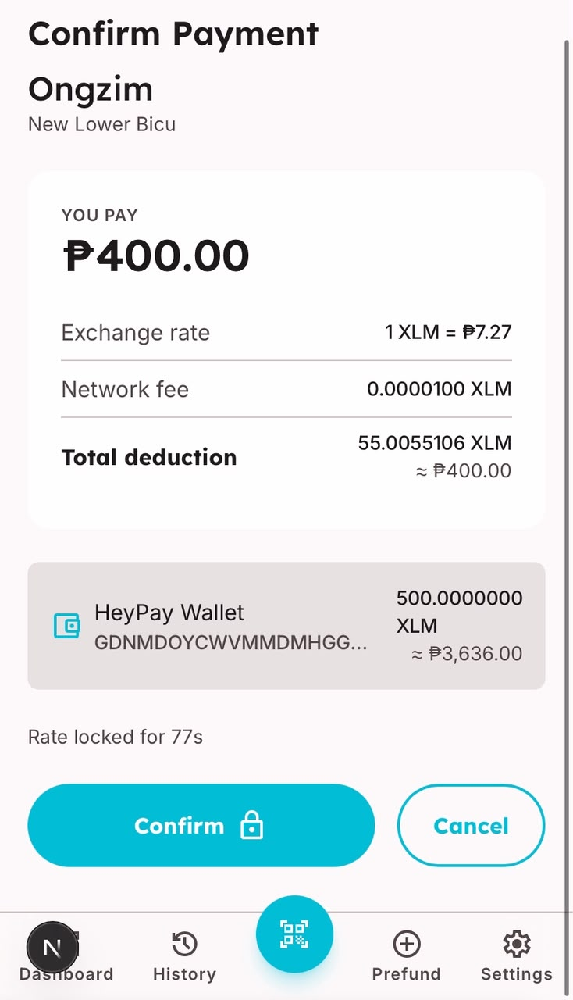
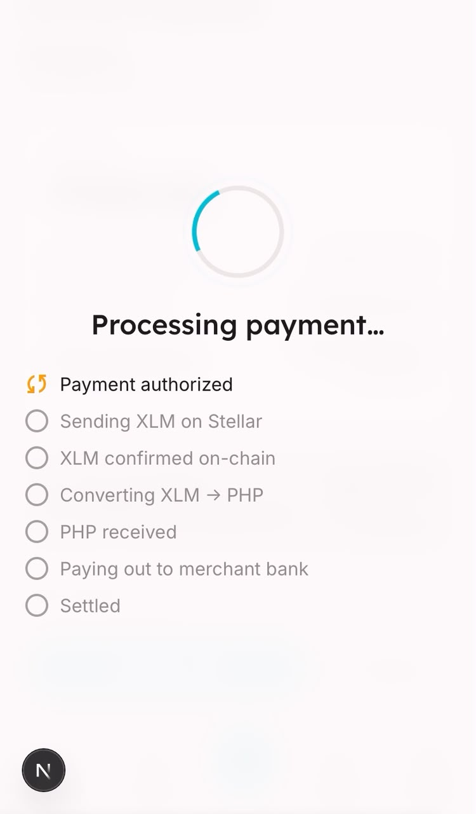
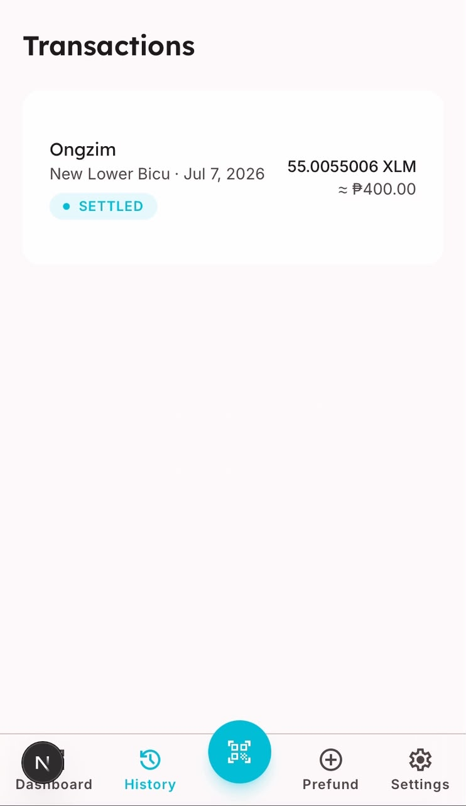

# HeyPay

> Pay any QRPH merchant in the Philippines straight from your Stellar (XLM) balance.

HeyPay is a fintech bridge between the Stellar network and the Philippines' national QR payment standard: a **Payer** prefunds a HeyPay-custodied Stellar wallet with XLM (or USDC), scans any existing **QRPH** merchant code — the same code every BSP-regulated PH merchant already accepts — and pays. HeyPay moves the payer's crypto on Stellar into the **HeyPay treasury** account, then pays the **Merchant** the peso amount from HeyPay's own PHP balance through a **Xendit payout** to their bank or e-wallet (GCash/Maya). Xendit emails its own payout receipt to the merchant, with HeyPay on cc. No merchant-side integration is required. The hero flow: scan QRPH → confirm a live crypto→PHP quote → HeyPay moves the crypto to its treasury on Stellar and pays the merchant in PHP via Xendit, with the payer watching a live status overlay track every step through to settlement. An **Admin** operator has full visibility and manual intervention (retry/refund) over the same pipeline.

For the Stellar ecosystem, HeyPay is a concrete instance of "everyday spending utility" for XLM and Stellar USDC — the missing last mile that turns a held crypto balance into a real-world payment accepted by ordinary merchants, in one of Stellar's most active real-world corridors (Philippine remittance and payments, alongside partners like Coins.ph and MoneyGram already live on Stellar). As shipped today it is a **complete but narrow, single-rail application**: every payer, merchant, and admin flow is implemented end to end, but HeyPay itself is the conversion counterparty (it collects crypto into its treasury and fronts the PHP payout from a prefunded Xendit balance), quotes are priced off public exchange order books (Coins.ph, with CoinMarketCap as a cross-check), and Stellar interaction is limited to classic Horizon payment operations — no SEPs, no Soroban. Its ecosystem impact today is real but local and demonstrative rather than structural; see [Ecosystem Roadmap](#ecosystem-roadmap--research) below for how SEP-based anchors, on-chain liquidity, and Soroban escrow contracts could turn it into reusable Stellar infrastructure rather than a single app.

## Status / License

|         |                                                                                                                                                                                                                                                                                                                                                                                                                                                                                                                             |
| ------- | --------------------------------------------------------------------------------------------------------------------------------------------------------------------------------------------------------------------------------------------------------------------------------------------------------------------------------------------------------------------------------------------------------------------------------------------------------------------------------------------------------------------------- |
| Version | `0.1.0` (`package.json`)                                                                                                                                                                                                                                                                                                                                                                                                                                                                                                    |
| Status  | **Feature-complete.** Auth, payer (prefund/scan/pay/history/settings), merchant (onboarding/dashboard/transactions/QR/settings), and admin (users/merchants/payments/health) surfaces are all implemented, backed by 94 unit/integration/component test files and a 4-spec Playwright e2e suite wired into CI, with a Railway deployment config (`railway.json` + `Dockerfile`). No Soroban/on-chain contract layer exists — see [Smart Contracts](#smart-contracts) and [Ecosystem Roadmap](#ecosystem-roadmap--research). |
| License | MIT — see [`LICENSE`](LICENSE)                                                                                                                                                                                                                                                                                                                                                                                                                                                                                              |

## Problem

Philippine merchants overwhelmingly accept payment through **QRPH**, the BSP's EMVCo-based national QR standard tied to PHP bank accounts. Meanwhile, someone holding **XLM** or Stellar **USDC** has no direct way to pay at those merchants — they would need to off-ramp to PHP through a separate exchange before they could pay anyone. HeyPay closes that gap: it is a custodial bridge that lets a payer spend XLM or USDC at any merchant who already accepts QRPH, with no merchant-side integration work required.

## Vision / Purpose

HeyPay v1 is a **web-only, production-shaped MVP**: custodial Stellar wallets, a HeyPay treasury account that collects each payer's crypto, live order-book pricing, PHP payouts to the merchant's registered bank or e-wallet via Xendit, and an admin console for operational oversight. Two rail modes — `mock` (deterministic, for local dev and CI) and `xendit` (Xendit v2 Payouts; test-mode keys move no real money) — let the full flow be demonstrated end to end.

XLM and USDC are the enabled payment assets (`PAYMENT_ASSETS=XLM,USDC`); USDT support exists in code but stays off until the treasury trusts a USDT issuer — see [Features](#features). Real KYC/AML/OTP flows and mobile apps remain deferred; no Soroban contract layer exists.

## Target Users

- **Payers** — XLM/USDC holders who want to spend crypto at everyday PH merchants without manually off-ramping first.
- **Merchants** — PH businesses that already accept QRPH and want to receive PHP from crypto-holding customers with zero extra integration (they just register their existing QR, a bank or e-wallet account, and an email for payout receipts).
- **Admins** — operators with full visibility into users, merchants, and payment health, plus manual retry/refund controls over stuck or failed settlements.

## Features

Everything below is implemented and running:

**Auth & accounts**

- Username/password signup and login with argon2id hashing, timing-safe dummy-hash comparison, IP + username rate limiting and lockout, and server-side sessions (`src/app/api/auth/*`, `src/server/auth/*`).
- CSRF protection via same-origin checks on all mutating routes (`src/server/auth/csrf.ts`) and role-based route access enforced in `src/proxy.ts` (Next.js middleware).
- Audit logging of security-relevant actions (`src/server/auth/audit.ts`).

**Payer**

- Custodial Stellar wallet per payer, generated and envelope-encrypted at signup (`src/server/stellar/wallet.ts`, `src/server/crypto/envelope.ts` — AES-256-GCM).
- Multi-asset wallets: hold and pay with XLM or an issued asset (USDC) enabled by the `PAYMENT_ASSETS` flag — including idempotent trustline setup, per-asset balances with per-token and total PHP value, and asset-tagged settlement/refunds (`src/server/wallet/balances.ts`, `src/server/stellar/assets.ts`, [`docs/multi-asset.md`](docs/multi-asset.md)).
- Prefund flow: deposit address + QR, background deposit detection (`src/app/(payer)/payer/prefund`, `src/server/queue/jobs/deposit-poller.ts`).
- QRPH scanning via camera (`getUserMedia` + `jsQR`) or image upload, decoded server-side with a real EMVCo TLV parser and CRC-16 validation, then resolved to exactly one registered merchant — an ambiguous match is refused (409) rather than guessed (`src/server/qrph/{tlv,crc,decode,resolve}.ts`).
- Live rate quoting priced at the **Coins.ph order-book bid** (`XLMPHP` / `USDCPHP`), cross-checked against **CoinMarketCap**; the quote is refused if the two disagree by more than `RATE_MAX_DIVERGENCE_BPS` (default 2%). Quotes carry a 90-second rate lock, funds-sufficiency checks, and idempotent confirmation (`src/server/rates/live.ts`, `src/server/payments/{quote,confirm,idempotency}.ts`).
- A `Payment` state machine (`CREATED → … → SETTLED/FAILED/REFUNDED`) driven asynchronously by a BullMQ worker, with a live-polling (and SSE-streamed) processing overlay (authorized → sending crypto to HeyPay → confirmed on Stellar → paying the merchant in PHP → settled) in the UI (`src/server/payments/state-machine.ts`, `src/server/queue/jobs/settle.ts`, `src/app/(payer)/payer/pay/[paymentId]/confirm`, `GET /api/payments/[id]/stream`).
- Personal transaction history with a detail drawer showing the full `PaymentEvent` timeline and links to the payment (and any refund) transaction on stellar.expert (`src/app/(payer)/payer/transactions`, `src/components/payer/TransactionDrawer.tsx`).
- Dashboard with live-polled balance, recent payments, and a network-status indicator (`src/app/(payer)/payer/dashboard`).

**Merchant**

- 4-step onboarding wizard (business identity → settlement bank → QRPH link → review/go-live) with a live payer-facing preview pane (`src/app/(merchant)/merchant/onboarding`, `src/components/merchant/onboarding/*`).
- Settlement account setup against the Xendit-supported list — banks (BPI, BDO, UnionBank, Metrobank, Landbank, PNB, Security Bank, CTBC, RCBC) and e-wallets (GCash, Maya) — with the account number envelope-encrypted at rest and only a masked last-4 exposed (`src/server/merchant/banks.ts`, `src/server/rails/xendit-channels.ts`, `src/app/api/merchant/settlement`).
- **Payout receipt email**: collected during settlement setup and required to go live; Xendit sends its payout receipt there on every successful payout (`src/lib/schemas/merchant.ts`, `src/server/merchant/service.ts`).
- QRPH upload/link with CRC validation and cross-merchant uniqueness enforcement — both on the exact code and on the QR's embedded merchant id (`src/app/api/merchant/qrph`).
- Go-live completeness gate (`ACTIVE` or `PENDING_REVIEW` behind a `MERCHANT_REVIEW_GATE` flag) (`src/app/api/merchant/go-live`).
- Dashboard with 1D / 1W / 1M / All range presets: total settled PHP for the range with change against the previous period, pending payouts (PHP still on its way to the merchant), a settled-payouts line chart (Philippine time, with a table view), and a business transactions table whose rows open the payment on stellar.expert (`src/app/(merchant)/merchant/dashboard`, `src/components/merchant/{EarningsCards,EarningsChart,RangeFilter}.tsx`).
- Business QR page (SVG + shareable payment link), a filterable/paginated transactions page, and a settings page (business/logo/bank/payout email/QRPH/password edit) (`src/app/(merchant)/merchant/{qr,transactions,settings}`).

**Admin**

- User management: list/search, activate/deactivate (`src/app/(admin)/admin/users`, `src/server/admin/users.ts`).
- Merchant review: search/filter, status transitions (`DRAFT`/`PENDING_REVIEW`/`ACTIVE`/`SUSPENDED`) (`src/app/(admin)/admin/merchants`, `src/server/admin/merchants.ts`).
- Payments: full listing with per-payment event timeline, plus manual **retry** (re-enqueues the settle job, gated to retryable statuses) and **refund** (moves a payment to `REFUND_PENDING`, limited to `STELLAR_CONFIRMED` — crypto is in the treasury but no payout has been requested — since a refund sends real funds back from the treasury) — both audit-logged (`src/app/(admin)/admin/payments`, `src/server/admin/payments.ts`).
- System health dashboard: live checks against Stellar Horizon, Xendit (including the PHP balance every payout is paid from, or "mock rail"), the live rate sources, Redis, and BullMQ queue depth (waiting/active/delayed/failed) (`src/app/(admin)/admin/health`, `src/server/admin/health.ts`).

**Platform / infra**

- `PaymentRailProvider` abstraction with a deterministic `MockProvider` and a `XenditProvider`, switched via `PAYMENT_RAIL` (`src/server/rails/{provider,mock,xendit,index}.ts`). The Xendit provider returns the treasury as the deposit address, prices quotes from live rates, and creates Xendit v2 payouts with the payment reference as the `Idempotency-key` (a retried request never pays the merchant twice) and a `receipt_notification` to the merchant's payout email, cc `XENDIT_RECEIPT_CC`.
- Treasury refunds: when settlement fails after the crypto has left the payer's wallet, the settle job sends the same amount back on-chain from the treasury. The send is claimed atomically and an ambiguous earlier attempt blocks a re-send until someone verifies the treasury, so a payer is never refunded twice (`src/server/queue/jobs/settle.ts`).
- BullMQ-driven worker process running the settlement state machine, deposit poller, and a reconciliation job that diffs wallet balances against Horizon and re-drives stale in-flight payments (`src/worker/index.ts`, `src/server/queue/*`). Xendit payouts take minutes, so a pending payout is never waited on in a tight loop: it is re-checked on the Xendit webhook, a delayed re-check (`PAYOUT_RECHECK_MS`, default 30s), or the reconcile job. On a Xendit test key the wait is skipped: the payment settles when Xendit accepts the payout, and Xendit's real answer is recorded afterwards (`PAYOUT_FAST_SETTLE`).
- File uploads via true S3 presigned-POST (content-type allowlist, size cap, post-upload magic-byte + size re-validation) for QRPH images and merchant logos (`src/app/api/uploads/presign`, `src/server/storage/s3.ts`).
- Xendit webhook receiver: verifies the `x-callback-token` (constant-time compare), is idempotent per delivery via the `IdempotencyKey` table, and only nudges the settle job — which asks Xendit for the payout's real status — so a forged callback can at most trigger a re-check (`src/app/api/webhooks/xendit`).
- Liveness health endpoint for Railway (`GET /api/health` — checks DB + Redis) separate from the deeper admin health dashboard.
- Security headers applied to every response (`src/lib/security-headers.ts`, wired through `proxy.ts`).

**Testing & deployment**

- 94 unit/integration/component test files (Vitest + Testing Library) plus a 4-spec Playwright e2e suite (`tests/e2e/{payer-happy-path,merchant-go-live,merchant-qr,admin-retry-refund}.spec.ts`) covering signup → prefund → scan → pay → settle, merchant onboarding → go-live, the business QR page, and admin retry/refund — all wired into `.github/workflows/ci.yml`.
- Railway deployment config: `railway.json` (Dockerfile builder, `pnpm prisma migrate deploy && pnpm prisma db seed` as the `preDeployCommand`, separate `web`/`worker` service definitions with healthchecks) and a 3-stage `Dockerfile` supporting both `pnpm start` and `pnpm worker:start` from one image.

Testnet-only scope:

- USDC is enabled via `PAYMENT_ASSETS` against the testnet issuer; USDT is implemented but disabled until the treasury holds a trustline to a USDT issuer. No mainnet issuer or treasury is configured (`src/server/stellar/assets.ts`, [`docs/multi-asset.md`](docs/multi-asset.md)).
- Xendit runs with test-mode keys: payouts go through Xendit's full lifecycle and send real receipt emails, but move no real money.

## Architecture



## Sequence diagrams

### 1. Pay a merchant (hero flow)



If the payout fails after the crypto reached the treasury, the payment moves to `REFUND_PENDING` and the worker sends the same amount back on-chain from the treasury to the payer's wallet (`REFUNDED`). A failure before the crypto moved releases the reservation and ends `FAILED` with nothing to refund.

### 2. Login (auth flow)



### 3. Prefund + async deposit detection



### 4. Xendit webhook callback + admin retry/refund



## Smart Contracts

**Soroban settlement escrow** — [`contracts/escrow`](contracts/escrow/README.md). It holds the payer's XLM on-chain under a per-payment job id until the merchant's Xendit payout settles (`release` to the treasury) or fails (`refund` to the payer). If HeyPay never acts, the payer can reclaim the funds with `refund_after_timeout` once the deadline ledger passes.

| Network | Contract ID                                                                                                                                                             |
| ------- | ----------------------------------------------------------------------------------------------------------------------------------------------------------------------- |
| Testnet | [`CA3IHLNNIMJEOXGQ4NNJIQCTWGW3X4NEQWVIVFWM3EHVCEFBZ73OBT7J`](https://stellar.expert/explorer/testnet/contract/CA3IHLNNIMJEOXGQ4NNJIQCTWGW3X4NEQWVIVFWM3EHVCEFBZ73OBT7J) |

- [Contract README](contracts/escrow/README.md): functions, auth rules, errors, deadline and TTL behaviour, deployment and Testnet evidence
- [Interface](contracts/escrow/INTERFACE.md): the deployed contract's spec
- [Sample events](contracts/escrow/events.sample.json): real `deposit` / `release` / `refund` event payloads from Testnet

The settle job uses the escrow when `ESCROW_ENABLED=true` (XLM payments only for now; `src/server/queue/jobs/settle.ts`, client in `src/server/stellar/escrow.ts`). With it off, the crypto goes straight to the custodial treasury through classic Horizon payments (`src/server/stellar/wallet.ts`).

A payer can take a held payment back themselves once its deadline ledger has passed. The payment detail drawer and the progress screen show **Refund from escrow**, which calls the contract's `refund_after_timeout` with the payer's custodial wallet (`POST /api/payments/:id/escrow-refund`, `src/server/payments/escrow-self-refund.ts`). HeyPay never makes that call on its own. The app offers it only when the merchant will not be paid for the same payment, because a payout the bank is already working on cannot be recalled:

- **Payout never requested, or stopped.** At the deadline the settle job asks the rail to cancel the payout (`POST /v2/payouts/:id/cancel` on Xendit, which only cancels a payout it has not processed yet). If it was stopped, or was never requested, the payment is cancelled: it moves to `REFUND_PENDING` with the reason "The merchant was not paid within the time limit, so this payment was cancelled" and waits there for the payer's refund.
- **Payout in progress.** If the rail can no longer stop it, the payment stays open and the payer is told the bank transfer is on its way. When it is paid the escrow is released; when it fails the settle job calls `refund()`.
- **Worker down.** A payout is only requested while the escrow still holds the crypto with time left on it. If the worker comes back after the deadline, or after the payer took the crypto back, no payout is sent.
- **Payout stalled.** A payout the rail has held for over 24 hours without an answer counts as stalled, and the payer can refund. With the default window that is already the case at the deadline, so the payer's timeout refund never depends on HeyPay acting. A payout that is paid after such a refund is audited as `payment.expired_payout_outcome` and reported for follow-up.

The deadline is the contract's window (17,280 ledgers, ~24h, by default) unless `ESCROW_TIMEOUT_LEDGERS` is set, in which case the settle job keeps the contract at that value. A shorter window is for testing only. Xendit cancels a payout only before it has sent it to the bank, which for bank and e-wallet transfers is within about a second; see "Known limit" in the [contract README](contracts/escrow/README.md).

## Ecosystem roadmap / research

HeyPay currently touches Stellar only through custodial wallets, a custodial treasury account, and classic Horizon payments; it does not yet use any Stellar Ecosystem Proposal (SEP) or Soroban. HeyPay is today its own conversion counterparty: it holds the crypto it collects and fronts PHP payouts from a prefunded Xendit balance, carrying the price risk between quote and sale. Ongoing research evaluates how **SEP-6/24/31 anchors, on-chain liquidity (Stellar DEX path payments into a PHP-pegged asset), and Soroban escrow contracts** could remove that treasury exposure, reduce reliance on a single payout provider, and turn HeyPay into real Stellar-ecosystem infrastructure rather than a single-app demo.

## Tech Stack

**Frontend**

- Next.js `^16.2.9` (App Router, RSC + Client Components), React `^19.2.7`
- Tailwind CSS `^4.3.1` (`@tailwindcss/postcss`)
- `clsx` for conditional class composition
- `jsqr` for client-side QR decoding (camera/upload)

**Backend / API**

- Next.js Route Handlers (`src/app/api/**`) + Server Actions
- Zod `^4.4.3` for input validation
- `decimal.js` for precise monetary math (no floats)
- `argon2` for password hashing
- `sodium-native` for cryptographic signing operations
- `qrcode` for server-side QR SVG rendering

**Database / queue**

- PostgreSQL via Prisma `^7.8.0` (`@prisma/client`, `@prisma/adapter-pg`, `pg`)
- Redis via `ioredis`, backing **BullMQ** `^5.79.2` job queues (settlement, deposit polling, reconciliation)

**Blockchain**

- `@stellar/stellar-sdk` `^16.0.1` against Horizon (testnet in dev, per `.env.example`)

**Payment rail integration**

- Custom `PaymentRailProvider` abstraction with `MockProvider` (deterministic, local dev) and `XenditProvider` (Xendit v2 Payouts REST API, idempotent payouts, receipt emails) plus a token-verified Xendit webhook receiver
- Live rates from the Coins.ph public `bookTicker` (no key) with CoinMarketCap `quotes/latest` as backup and cross-check

**Object storage**

- AWS SDK v3 (`@aws-sdk/client-s3`, `s3-presigned-post`, `s3-request-presigner`) against MinIO (dev) or an S3-compatible bucket (prod)
- `sharp` for image processing

**Infra / local dev**

- Docker Compose (`docker-compose.yml`, `docker-compose.test.yml`): Postgres 17, Redis 7, MinIO
- `pnpm` `10.33.0` workspace, Node `>=22`

**Testing / quality**

- Vitest `^4.1.9` + Testing Library (`@testing-library/react`, `@testing-library/dom`) + `jsdom` — 94 unit/integration/component test files
- Playwright — 4-spec e2e suite (`tests/e2e/`)
- ESLint `^10.6.0` + `typescript-eslint`, Prettier `^3.9.1`
- TypeScript `^6.0.3`

**CI / Deployment**

- GitHub Actions (`.github/workflows/ci.yml`): install → Prisma generate/migrate → typecheck → lint → format check → `pnpm audit --prod` → unit/integration tests (Vitest) → build → Playwright install + e2e → report upload.
- Railway (`railway.json` + `Dockerfile`): Dockerfile-based build, `pnpm prisma migrate deploy && pnpm prisma db seed` as the pre-deploy command, separate `web` (`pnpm start`, `/api/health` healthcheck) and `worker` (`pnpm worker:start`, always-restart) services from one image.

## How to Run Locally

Required tooling: **Node ≥22**, **pnpm 10.33.0** (`packageManager` field — use `corepack enable` or install directly), and **Docker** (for local Postgres/Redis/MinIO).

1. **Clone and install dependencies**

   ```bash
   git clone https://github.com/artisam-heypay/heypay.git
   cd heypay
   pnpm install
   ```

2. **Start local infrastructure** (Postgres, Redis, MinIO)

   ```bash
   docker compose up -d
   ```

3. **Configure environment variables**

   ```bash
   cp .env.example .env
   ```

   Then edit `.env`. Variable groups and whether they're required:

   | Variable                                                                                         | Required?                         | Notes                                                                                                                                                                               |
   | ------------------------------------------------------------------------------------------------ | --------------------------------- | ----------------------------------------------------------------------------------------------------------------------------------------------------------------------------------- |
   | `DATABASE_URL`, `SHADOW_DATABASE_URL`                                                            | **Required**                      | Must point at the Postgres started above (or your own instance).                                                                                                                    |
   | `REDIS_URL`                                                                                      | **Required**                      | BullMQ + rate limiting/session cache.                                                                                                                                               |
   | `SESSION_SECRET`, `ENCRYPTION_MASTER_KEY`, `ENCRYPTION_KEY_VERSION`                              | **Required**                      | Session signing + AES-256-GCM envelope encryption for wallet secrets and bank account numbers. Never commit real values.                                                            |
   | `ADMIN_USERNAME`, `ADMIN_PASSWORD`                                                               | **Required** for seeding          | Consumed by `prisma/seed.ts` to create the seeded admin user (idempotent upsert).                                                                                                   |
   | `SEED_DEMO`                                                                                      | Optional                          | `true` also seeds a demo payer (testnet-funded wallet) and demo merchant so the flows work immediately.                                                                             |
   | `STELLAR_NETWORK`, `STELLAR_HORIZON_URL`, `STELLAR_NETWORK_PASSPHRASE`                           | **Required**                      | Defaults in `.env.example` point at Stellar **testnet**.                                                                                                                            |
   | `PAYMENT_ASSETS`, `USDC_ASSET_ISSUER`, `USDT_ASSET_ISSUER`                                       | Optional                          | Enabled payment assets (default `.env.example`: `XLM,USDC`). Issuers default to the testnet issuer; **required** on mainnet. Every enabled issued asset needs a treasury trustline. |
   | `PAYMENT_RAIL`                                                                                   | **Required**                      | `mock` (default, deterministic local rail) or `xendit` (treasury + Xendit payouts).                                                                                                 |
   | `HEYPAY_TREASURY_PUBLIC_KEY`                                                                     | Required if `PAYMENT_RAIL=xendit` | Stellar account that receives every payer's crypto.                                                                                                                                 |
   | `HEYPAY_TREASURY_SECRET_ENC`                                                                     | Required if `PAYMENT_RAIL=xendit` | Envelope-encrypted treasury secret (same scheme as custodial wallets), used only to send refunds. Never commit the raw `S...` key.                                                  |
   | `XENDIT_SECRET_KEY`                                                                              | Required if `PAYMENT_RAIL=xendit` | `xnd_development_...` (test) or `xnd_production_...` (live).                                                                                                                        |
   | `XENDIT_CALLBACK_TOKEN`                                                                          | Required for Xendit webhooks      | Verification token Xendit sends in `x-callback-token`; point the payout webhook at `/api/webhooks/xendit`.                                                                          |
   | `XENDIT_RECEIPT_CC`                                                                              | Optional                          | Up to 3 comma-separated HeyPay addresses cc'd on every payout receipt (they become the recipients when a merchant has no payout email).                                             |
   | `CMC_API_KEY`, `RATE_MAX_DIVERGENCE_BPS`, `CMC_CACHE_MS`                                         | Optional                          | CoinMarketCap backup/cross-check for live rates; max Coins.ph↔CMC gap (default `200` = 2%); CMC cache window.                                                                       |
   | `PAYOUT_RECHECK_MS`                                                                              | Optional                          | Delay before re-checking a payout Xendit still reports pending (default `30000`).                                                                                                   |
   | `PAYOUT_FAST_SETTLE`                                                                             | Optional                          | Xendit test keys only, never mainnet: a payment is SETTLED once Xendit accepts the payout; the real result is checked after and audited. `false` waits for Xendit.                  |
   | `MOCK_*_PHP_RATE`, `MOCK_RAIL_DELAY_MS`, `MOCK_FAIL_PHP_AMOUNT`                                  | Optional                          | Mock-rail tuning; `MOCK_FAIL_PHP_AMOUNT` forces a payout failure (and treasury refund path) for demos/e2e.                                                                          |
   | `S3_ENDPOINT`, `S3_REGION`, `S3_BUCKET`, `S3_ACCESS_KEY`, `S3_SECRET_KEY`, `S3_FORCE_PATH_STYLE` | **Required**                      | Defaults target the local MinIO container.                                                                                                                                          |
   | `APP_URL`                                                                                        | **Required**                      | Used for same-origin/CSRF checks and absolute links.                                                                                                                                |

4. **Run database migrations and seed data**

   ```bash
   pnpm prisma migrate deploy
   pnpm prisma db seed
   ```

5. **Start the web app**

   ```bash
   pnpm dev
   ```

   App runs at `http://localhost:3000` (or `APP_URL`).

6. **Start the background worker** (separate terminal — required for prefund detection, payment settlement, payout re-checks, and refunds to progress)

   ```bash
   pnpm worker:dev
   ```

7. **Optional: run the quality gate locally**

   ```bash
   pnpm typecheck
   pnpm lint
   pnpm format:check
   pnpm test
   pnpm build
   ```

8. **Optional: run the Playwright e2e suite** (spins up a dedicated e2e Postgres/Redis, mock rail + Stellar testnet)
   ```bash
   pnpm test:e2e:up
   pnpm test:e2e
   pnpm test:e2e:down
   ```

## Deployment

HeyPay deploys to **Railway** via `railway.json` + a 3-stage `Dockerfile`: a `web` service (`pnpm start`, healthcheck `/api/health`) and a `worker` service (`pnpm worker:start`, always-restart) built from the same image, with `pnpm prisma migrate deploy && pnpm prisma db seed` running as the `preDeployCommand` against managed Postgres/Redis plugins. With `PAYMENT_RAIL=xendit`, point the Xendit dashboard's payout webhook at `https://<host>/api/webhooks/xendit` and keep the Xendit PHP balance funded — every merchant payout is paid from it (the admin health page shows the balance).

CI (`.github/workflows/ci.yml`) runs on pushes to `main` and on pull requests, gating on typecheck/lint/format/audit/Vitest/build/Playwright e2e; it does not itself deploy.

Live app: **<https://heypayfi.xyz>** — runs on **Stellar Testnet** with **Xendit test-mode** payouts; no mainnet deployment.

## Demo

- **Live app** — <https://heypayfi.xyz> (Stellar Testnet; Xendit test mode — no mainnet deployment)
- **Demo video** — [full payer → merchant flow, prefund through settlement](https://drive.google.com/file/d/180WchiglLB2r86xSGTnYe4oCA0aw39xl/view?usp=drive_link)
- **Pitch deck** — [HeyPay pitch deck (Google Slides)](https://docs.google.com/presentation/d/1DgvF_3rFOoeh-4ty3xClKzs5l2eVVQub/edit?usp=drive_link&ouid=105919425575897775501&rtpof=true&sd=true)

### The hero flow, screen by screen

| 1. Scan                                                                      | 2. Confirm                                                                                              |
| ---------------------------------------------------------------------------- | ------------------------------------------------------------------------------------------------------- |
|  |  |

| 3. Settle                                                                                                            | 4. Done                                                                                       |
| -------------------------------------------------------------------------------------------------------------------- | --------------------------------------------------------------------------------------------- |
|  |  |

## Team

HeyPay is designed, built, and maintained by one person.

| Name                                              | Role                                       | Contact                                                   |
| ------------------------------------------------- | ------------------------------------------ | --------------------------------------------------------- |
| [Ronald Ajusan](https://github.com/ronaldajusan0) | Solo developer — full-stack, design, infra | [ronaldajusan0@gmail.com](mailto:ronaldajusan0@gmail.com) |

Built under [Artisam Labs](https://artisam.xyz).

## License

MIT — see [`LICENSE`](LICENSE). Copyright © 2026 Ronald Ajusan (Artisam Labs).
