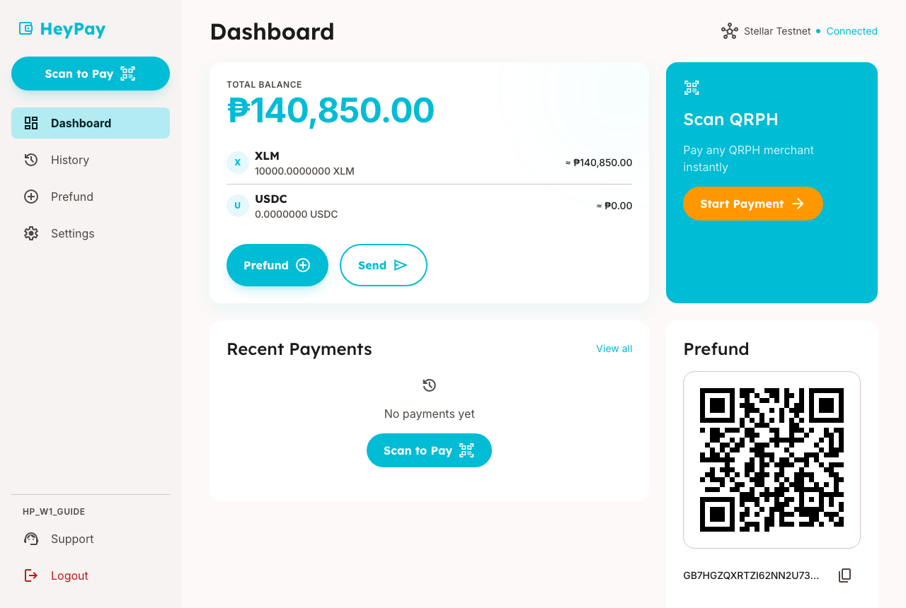
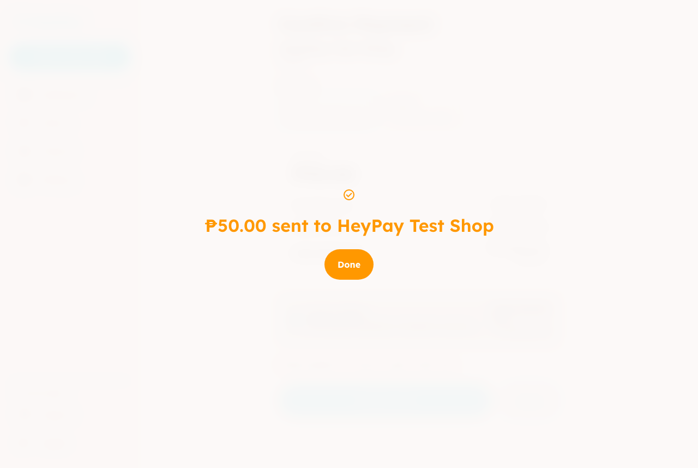

# HeyPay quick test — Week 1

**What we are testing this week:** paying a shop's QR code with HeyPay, the way it works today.

| Time needed      | Tasks                    | Thank-you            |
| ---------------- | ------------------------ | -------------------- |
| About 20 minutes | 4 tasks + a short survey | ₱{{INCENTIVE_BASIC}} |

**[Open the survey]({{SURVEY_URL}})** · **[Report a bug]({{BUG_FORM_URL}})** · **[Send your files]({{HANDIN_URL}})**

## Before you begin

**You need:**

- A laptop or desktop computer with Chrome, Edge or Safari.
- Your phone, for the last task.
- The HeyPay login we sent you (a username and a password).
- The test shop QR code picture we sent you (`heypay-test-shop.png`).

**You will send us:** only your survey answers. You do not need to record your screen or take screenshots this week.

> **Testnet only — this is play money.** Everything in this test uses practice money that has no value. We will never ask you for real money, a bank card, or a secret phrase. If anything asks for one, stop and tell us.

> **We are testing HeyPay, not you.** If something is confusing, that is useful for us. There are no wrong answers.

**What we record:** your survey answers and the time you spent. HeyPay also counts which pages were opened in your test account. We do not record your screen, camera or microphone in this test.

## Words you'll see

| Word               | What it means                                                                             |
| ------------------ | ----------------------------------------------------------------------------------------- |
| **Testnet**        | The practice version of HeyPay. It uses play money.                                       |
| **XLM**            | The kind of play money in your HeyPay account. The app also shows its value in pesos (₱). |
| **QRPH**           | The same QR codes shops already put on their counters for bank and GCash payments.        |
| **Stellar**        | The public payment network HeyPay uses to move money.                                     |
| **Stellar Expert** | A public website where anyone can look up a payment, like a tracking page for a parcel.   |
| **Network fee**    | A tiny charge, less than one centavo, for sending a payment on Stellar.                   |

## What changed since last week

This is the first round. Every task is new.

## At a glance

| Task                            | Minutes | Done |
| ------------------------------- | ------- | ---- |
| B1 First impression             | 2       | ☐    |
| Sign in                         | 2       | ☐    |
| B2 What the dashboard tells you | 4       | ☐    |
| B3 Pay a shop ₱50               | 6       | ☐    |
| B4 Check your payment           | 4       | ☐    |
| Survey                          | 2       | ☐    |

## B1 — First impression (2 minutes)

**Why this matters:** most people decide in seconds whether a payment app looks safe.

1. Open **heypayfi.xyz** on your computer.
2. Look at the first screen for **10 seconds**. Do not scroll.
3. Close your eyes and say out loud what HeyPay does.

- [ ] You see the headline "Pay any QRPH merchant with your Stellar balance."

**If it doesn't match:** check _Known issues_ below, then [report it]({{BUG_FORM_URL}}).

> Answer survey section **B1**.

## Sign in (2 minutes)

1. On heypayfi.xyz, click **Open HeyPay**.
2. Type the **Username** and **Password** we sent you.
3. Click **Sign in**.

- [ ] You see a page called **Dashboard**.

**If it doesn't match:** if you see "Invalid username or password.", check for a typo and try once more. Then [report it]({{BUG_FORM_URL}}).

## B2 — What the dashboard tells you (4 minutes)

**Why this matters:** you should know how much you have, and what you can do, without help.

1. Stay on the **Dashboard**. Do not click anything yet.
2. Find how much money you have.
3. Find what you can do from this page.

- [ ] You see **Total Balance** with an amount in pesos (₱).
- [ ] You see a card called **Scan QRPH**.

**If it doesn't match:** check _Known issues_, then [report it]({{BUG_FORM_URL}}).

> Answer survey section **B2**: How much money do you have? What do you think you can do here?

## B3 — Pay a shop ₱50 (6 minutes)

**Why this matters:** this is the main thing HeyPay does.

This task has no step-by-step instructions on purpose.

**Your goal:** pay the test shop **₱50** with the QR code picture we sent you (`heypay-test-shop.png`). Use your HeyPay account. Your camera will not work for a picture on the same screen, so look for another way to give HeyPay the QR code.

- [ ] At the end you see **₱50.00 sent to HeyPay Test Shop** and a **Done** button.

The last step, "Paying the merchant in PHP", can take a few minutes. That is normal. Wait up to 5 minutes before you report it.

**If it doesn't match:** write down the exact message you see, then [report it]({{BUG_FORM_URL}}).

> Answer survey section **B3**: Where did you get stuck, if anywhere? Where did you think your money was while you waited?

## B4 — Check your payment (4 minutes)

**Why this matters:** people trust a payment more when they can check it themselves.

1. Click **History** in the menu.
2. Click your ₱50 payment.
3. Under **Payment on Stellar**, click the small arrow icon next to the code. A new tab opens on the Stellar Expert website.

   

4. Compare the new tab with HeyPay. Do they show the same payment?
5. **On your phone:** open **heypayfi.xyz**, tap **Open HeyPay**, sign in, and tap the round scan button at the bottom. Do not pay anything.

- [ ] In History, your payment shows **SETTLED**.
- [ ] The Stellar Expert page opens in a new tab.
- [ ] On your phone, you see **Scan to Pay** and a **Use camera** button.

**If it doesn't match:** check _Known issues_, then [report it]({{BUG_FORM_URL}}).

> Answer survey section **B4**: Did the Stellar Expert page match? Would you use HeyPay on your phone?

## Known issues

- The last step, **Paying the merchant in PHP**, took about 5 minutes in our own test. That is normal.

- The page title says **Transactions**, but the menu item says **History**. They are the same page.
- The **Support** link in the menu does not open a page yet.
- The code under **Payment on Stellar** is shortened, for example `a1b2c3d4…e5f6a7b8`. That is normal.
- The Stellar Expert page shows amounts in XLM, not pesos.

## Troubleshooting

| You see                                       | Try                                                                                     |
| --------------------------------------------- | --------------------------------------------------------------------------------------- |
| "Could not read this code. Try again."        | Use the picture we sent, not a photo of your screen.                                    |
| "Could not start payment. Try again."         | Your play money may have run out. Tell us through the bug form.                         |
| "Quote expired — rescan to get a fresh rate." | You waited more than 90 seconds. Start the payment again.                               |
| "Camera needs a secure (HTTPS) connection…"   | Check the address starts with `https://`. Or use **Upload image**.                      |
| "Payment failed"                              | Write down the message under it, then report it. Your play money comes back on its own. |

## Not in this round

- The shop (merchant) side of HeyPay.
- The admin pages.
- USDC and USDT. Pay with XLM only.
- Anything with real money.

## Hand-in and your thank-you

1. Finish the [survey]({{SURVEY_URL}}) by **{{DEADLINE}}**.
2. That's all. You do not need to send files this week.

We send your ₱{{INCENTIVE_BASIC}} to your GCash within **{{PAYOUT_DAYS}}** days after the deadline.

**Couldn't finish?** Tell us where you stopped in the survey. An honest "I couldn't finish" still counts, and you still get your thank-you.
