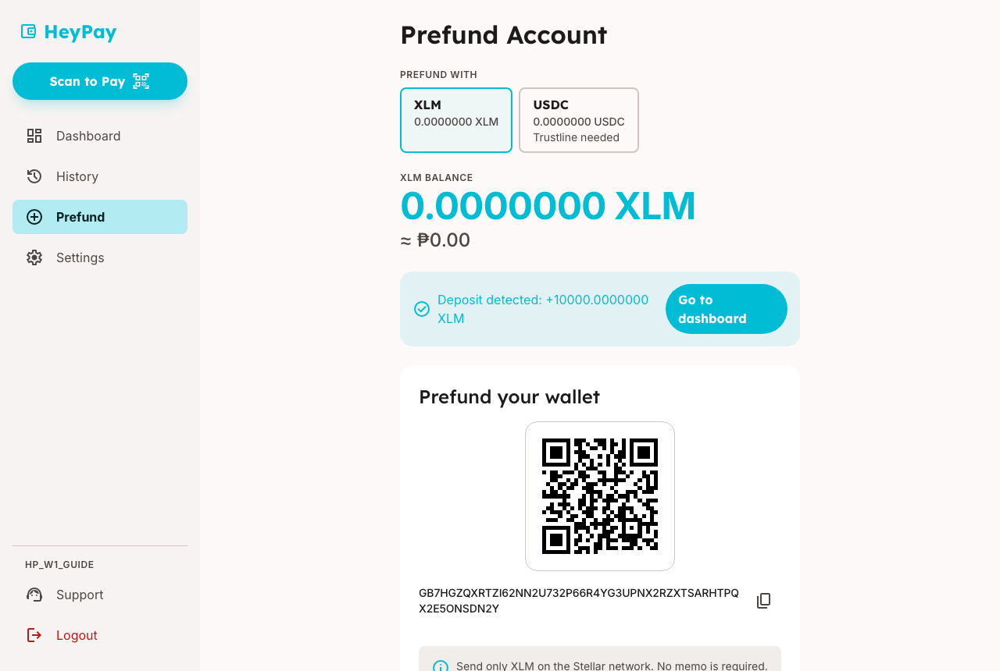
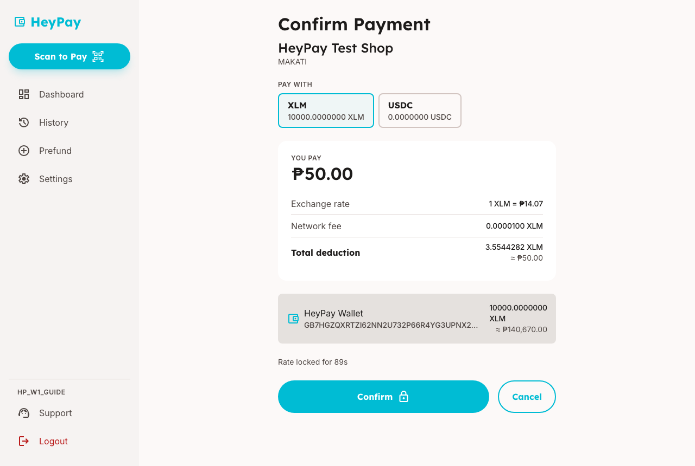
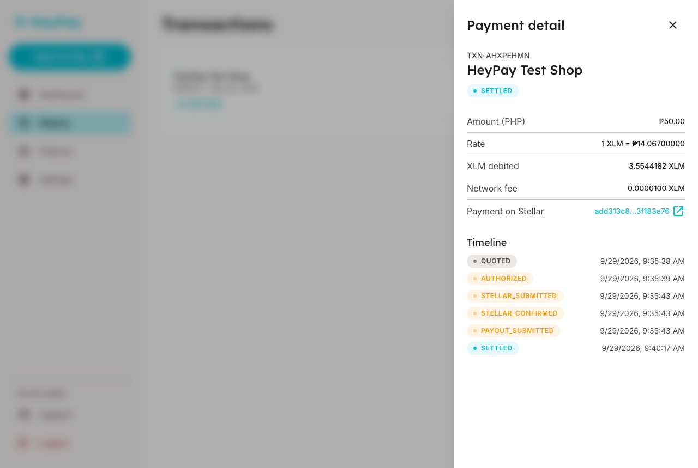
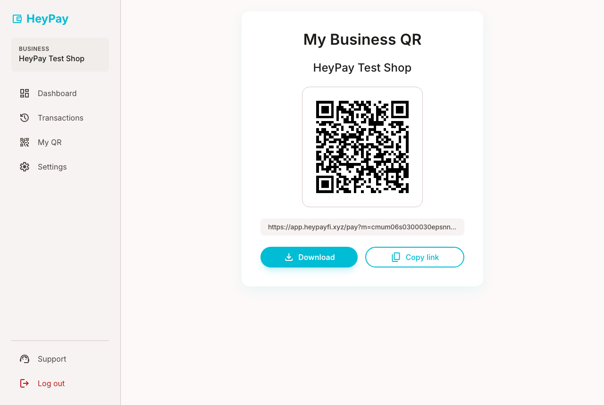
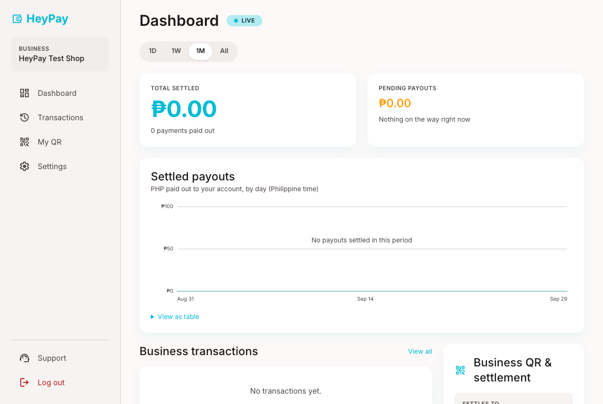

# HeyPay recorded test — Week 1

**What we are testing this week:** paying a shop with HeyPay, and setting up a shop to get paid, the way HeyPay works today.

| Time needed                       | Tasks                       | Thank-you                |
| --------------------------------- | --------------------------- | ------------------------ |
| 60–70 minutes, recorded with Loom | 6 tasks + closing questions | ₱{{INCENTIVE_INTERVIEW}} |

**[Open the answers form]({{SURVEY_URL}})** · **[Report a bug]({{BUG_FORM_URL}})** · **[Send your files]({{HANDIN_URL}})**

<div class="page-break"></div>

## Before you begin

**You need:**

- A laptop or desktop computer with Chrome, Edge or Safari.
- The Loom desktop app (free).
- Two HeyPay logins we sent you: a **payer** login (to pay) and a **shop** login (to get paid).
- Two pictures we sent you:
  - `heypay-test-shop.png`: the test shop's QR code, which you will pay.
  - `your-shop-qrph-NN.png` (NN is your tester number): a QR code for your own practice shop.
- A quiet place for about an hour.

**You will send us:**

- Your Loom video link.
- Your answers file (template at the end of this guide).
- The screenshots named in the tasks.

> **Testnet only — this is play money.** Everything in this test uses practice money that has no value. We will never ask you for real money, a bank card, or a secret phrase. If anything asks for one, stop and tell us.

> **We are testing HeyPay, not you.** Please think out loud the whole time. Say what you expect, what surprises you, and what you would do next. Confusion is useful to us.

**What we record:**

- Your screen, your voice and your camera, through Loom, for as long as you record.
- Your answers file and screenshots.
- Which pages were opened in your two test accounts.

Close anything private (email, chats, banking) before you start recording.

## Set up Loom (6 minutes)

1. Install the **Loom desktop app** from loom.com and sign in.
2. Choose **Screen + Camera**, with your microphone on.
3. Record a **10-second test clip**: say your name and today's date. Play it back, and check you can hear yourself and see your screen.
4. Delete the test clip. Start the real recording when you begin T1.

## Words you'll see

| Word                   | What it means                                                                                     |
| ---------------------- | ------------------------------------------------------------------------------------------------- |
| **Testnet**            | The practice version of HeyPay. It uses play money.                                               |
| **XLM**                | The kind of play money you will use. The app also shows its value in pesos (₱).                   |
| **QRPH**               | The same QR codes shops already put on their counters for bank and GCash payments.                |
| **Stellar**            | The public payment network HeyPay uses to move money.                                             |
| **Wallet address**     | A long code starting with **G**. It is like an account number for your HeyPay wallet.             |
| **Prefund**            | Putting money into your HeyPay wallet before you pay.                                             |
| **Stellar Expert**     | A public website where anyone can look up a payment, like a tracking page for a parcel.           |
| **Network fee**        | A tiny charge, less than one centavo, for sending a payment on Stellar.                           |
| **Exchange rate**      | How many pesos one XLM is worth right now. HeyPay holds it still for 90 seconds while you decide. |
| **Settlement account** | The bank or GCash account where a shop receives its pesos.                                        |

## What changed since last week

This is the first round. Every task is new.

## At a glance

| Task                           | Minutes | Screenshot              | Done |
| ------------------------------ | ------- | ----------------------- | ---- |
| T1 Add play money              | 10      | `t1-deposit.png`        | ☐    |
| T2 Scan and pay a shop         | 10      | `t2-confirm.png`        | ☐    |
| T3 Find and check your payment | 6       | `t3-stellar-expert.png` | ☐    |
| T4 Set up your shop            | 14      | `t4-my-qr.png`          | ☐    |
| T5 Read your shop dashboard    | 6       | `t5-dashboard.png`      | ☐    |
| T7 Explore on your own         | 8       | —                       | ☐    |
| Closing questions              | 8       | —                       | ☐    |

There is no T6 this week.

<div class="page-break"></div>

<div class="card">

## T1 — Add play money (10 minutes)

**Why this matters:** before anyone can pay, they need money in HeyPay, and that first step has to be clear.

1. Open **heypayfi.xyz** and click **Open HeyPay**.
2. Sign in with your **payer** login and click **Sign in**.
   - [ ] You see **Dashboard**, and your **Total Balance** is ₱0.00.
3. Click **Prefund** in the menu.
   - [ ] You see **Prefund Account** and a card called **Prefund your wallet** with a QR code.
4. If you see **Prefund with**, choose **XLM**.
5. Click the copy icon next to your wallet address (the code starting with **G**).
   - [ ] You see **Address copied**.
6. Open a new tab and go to the play-money page we sent you: **{{PLAY_MONEY_URL}}**. Paste your address into the box and press the button to get play money.
7. Go back to the HeyPay tab and wait. Do not refresh. HeyPay checks every 10 seconds.
   - [ ] You see **Deposit detected** with a plus sign and an amount.

   

8. Click **Go to dashboard**.
   - [ ] **Total Balance** now shows pesos, and XLM has an amount.

**SCREENSHOT:** t1-deposit.png, taken when you see "Deposit detected".

**If it doesn't match:** wait 1 minute more, then check _Known issues_ and [report it]({{BUG_FORM_URL}}).

> **Ask yourself out loud:** Would you know how to add money without this guide? What would you expect to see instead of a wallet address?

</div>

<div class="card">

## T2 — Scan and pay a shop (10 minutes)

**Why this matters:** this is the main thing HeyPay does. The confirm screen is where people decide to trust it.

1. On the **Dashboard**, find the **Scan QRPH** card and click **Start Payment**.
   - [ ] You see **Scan to Pay**, with **Use camera** and **Upload image** buttons.
2. Click **Upload image** and choose `heypay-test-shop.png`.
3. If you see **Amount to pay (PHP)**, type **75** and click **Continue**.
   - [ ] You see **Confirm Payment** with the shop's name.
4. **Read the whole screen out loud**, top to bottom: **You pay**, **Exchange rate**, **Network fee** and **Total deduction**.
   - [ ] You see **Rate locked for** with a countdown in seconds.

   

5. Before the countdown ends, click **Confirm**.
   - [ ] You see **Processing payment…** with a list of steps.
6. Watch the steps and say what you think each one means. The step **Paying the merchant in PHP** can take a few minutes. That is normal.
   - [ ] At the end, you see **₱75.00 sent to HeyPay Test Shop**.

7. Click **Done**.

**SCREENSHOT:** t2-confirm.png, of the **Confirm Payment** screen before you click Confirm.

**If it doesn't match:** if you see **Quote expired — rescan to get a fresh rate.**, start again from step 1. For anything else, write down the exact message and [report it]({{BUG_FORM_URL}}).

> **Interview question:** Between tapping **Confirm** and the shop getting paid, where did you think your money was?

</div>

<div class="card">

## T3 — Find and check your payment (6 minutes)

**Why this matters:** people trust a payment more when they can check it themselves.

1. Click **History** in the menu.
   - [ ] Your ₱75 payment is at the top with the label **SETTLED**.
2. Click the payment.
   - [ ] You see **Payment detail** with **Amount (PHP)**, **Rate** and **Network fee**.
3. Under **Payment on Stellar**, click the small arrow icon next to the code.

   
   - [ ] A new tab opens on the Stellar Expert website.

4. Compare the two tabs out loud. What matches? What is different?

**SCREENSHOT:** t3-stellar-expert.png, of the Stellar Expert tab.

**If it doesn't match:** check _Known issues_, then [report it]({{BUG_FORM_URL}}).

> **Interview question:** Does seeing the payment on a public website make you trust HeyPay more, less, or no different? Why?

</div>

<div class="card">

## T4 — Set up your shop (14 minutes)

**Why this matters:** shop owners set this up once, alone, and it has to be easy.

1. Log out: click **Logout** at the bottom of the menu.
2. Sign in with your **shop** login.
   - [ ] You see **Dashboard** and an orange box: **Finish setting up your business**.
3. Click **Complete onboarding**.
   - [ ] You see **STEP 1 OF 4**.
4. **Business identity:** type a made-up shop name in **Business name**. Click **Continue**.
5. **Settlement account:** this is practice mode, so no real money moves. Enter:
   - **Bank or wallet:** GCASH · GCash
   - **Account name:** your first name
   - **Account number:** 09171234567
   - **Payout receipt email:** your own email address

   Then click **Continue**.

6. **Link your QRPH:** click **Upload QRPH image** and choose your `your-shop-qrph-NN.png`.
   - [ ] You see **Detected:** followed by a name and a city.

   Click **Continue**.

7. **Review & go live:** check the four rows (**Business**, **Settlement**, **Receipts to**, **QRPH**). Click **Go live**.
   - [ ] You see your shop's **Dashboard** with a **Live** badge.
8. Click **My QR** in the menu.
   - [ ] You see **My Business QR** with a **Download** button.

   

**SCREENSHOT:** t4-my-qr.png, of the **My Business QR** page.

**If it doesn't match:** if you see **This QRPH is already registered to another HeyPay merchant**, stop and tell us. We will send you a new picture. For anything else, [report it]({{BUG_FORM_URL}}).

> **Interview question:** Which step would a real shop owner find hardest? What would stop them from finishing?

</div>

<div class="card">

## T5 — Read your shop dashboard (6 minutes)

**Why this matters:** shop owners check this page to know if they got paid.

1. Click **Dashboard** in the menu.
2. Find the buttons **1D**, **1W**, **1M** and **All**. Click each one.
   - [ ] The chart title **Settled payouts** stays, and the text under it changes (by hour, day, week or month).
3. Your shop is brand new, so the chart shows **No payouts settled in this period**. Say out loud what you would expect it to show after a busy week.
4. Read **Total settled** and **Pending payouts** out loud and say what each one means to you.



**SCREENSHOT:** t5-dashboard.png, of the dashboard on **1W**.

**If it doesn't match:** check _Known issues_, then [report it]({{BUG_FORM_URL}}).

> **Interview question:** What is the first number you look at here? What is missing?

</div>

<div class="card">

## T7 — Explore on your own (8 minutes)

**Why this matters:** you will find things our tasks did not think of.

Use either login and click around freely. Keep thinking out loud. Try things you would try as a real customer or a real shop owner.

> **Interview question:** What was the most confusing thing you saw today?

</div>

<div class="page-break"></div>

## Closing questions (8 minutes)

Answer these out loud on the recording, and write short answers in your answers file.

1. In your own words, what does HeyPay do?
2. What would make you trust this with real pesos?
3. What would stop you from using it?
4. Would you tell a shop owner you know about it? Why or why not?

**Quick ratings (1 = not at all, 5 = very):**

| Question                                      | 1   | 2   | 3   | 4   | 5   |
| --------------------------------------------- | --- | --- | --- | --- | --- |
| How easy was it to pay a shop?                | ☐   | ☐   | ☐   | ☐   | ☐   |
| How easy was it to set up a shop?             | ☐   | ☐   | ☐   | ☐   | ☐   |
| How much do you trust HeyPay with your money? | ☐   | ☐   | ☐   | ☐   | ☐   |
| How clear were the words on screen?           | ☐   | ☐   | ☐   | ☐   | ☐   |

Stop the Loom recording now.

## Known issues

- After **Deposit detected**, the balance at the top of the Prefund page can still say 0 XLM. Click **Go to dashboard** to see the new balance.
- After **Go live**, the orange **Finish setting up your business** box can stay on the page. Log out and sign in again, and it is gone.
- The step **Paying the merchant in PHP** took about 5 minutes in our own test. That is normal.

- The page title says **Transactions**, but the menu item says **History**. They are the same page.
- The **Support** link in the payer menu does not open a page yet.
- The code under **Payment on Stellar** is shortened, for example `a1b2c3d4…e5f6a7b8`. That is normal.
- **History** sometimes shows codes like `STELLAR_SUBMITTED` in the **Timeline**. That is normal for now.
- The **Copy link** button on **My Business QR** copies a link that does not open a page yet.
- The payer menu says **Logout**, and the shop menu says **Log out**. They do the same thing.

## Troubleshooting

| You see                                       | Try                                                                                   |
| --------------------------------------------- | ------------------------------------------------------------------------------------- |
| No "Deposit detected" after 2 minutes         | Check you pasted the whole address, starting with **G**. Then report it.              |
| "Could not read this code. Try again."        | Use the picture we sent, not a photo of your screen.                                  |
| "Could not start payment. Try again."         | Your play money may not have arrived. Check **Total Balance** on the Dashboard.       |
| "Quote expired — rescan to get a fresh rate." | You waited more than 90 seconds. Start the payment again.                             |
| "Payment failed"                              | Write down the message under it and report it. Your play money comes back on its own. |
| "Forbidden"                                   | You are signed in with the other login. Log out and sign in with the right one.       |

## Not in this round

- The admin pages.
- USDC and USDT. Pay with XLM only.
- A failed payment that gets refunded (T6). We cannot trigger one on demand yet.
- Anything with real money.

## Hand-in and your thank-you

Send these through the **[hand-in form]({{HANDIN_URL}})** by **{{DEADLINE}}**:

1. Your Loom video link. Set it to "Anyone with the link can view".
2. Your answers file.
3. Your five screenshots: `t1-deposit.png`, `t2-confirm.png`, `t3-stellar-expert.png`, `t4-my-qr.png`, `t5-dashboard.png`.

We send your ₱{{INCENTIVE_INTERVIEW}} to your GCash within **{{PAYOUT_DAYS}}** days after we receive your files.

**Couldn't finish?** Send what you have and tell us where you stopped. An honest "I couldn't finish" still counts, and you still get your thank-you.

<div class="page-break"></div>

## Answers file template

Copy this into a document named `heypay-week1-answers-<your name>`.

```text
HeyPay Week 1 — answers
Name:
Date:
Device and browser:

T1 Add play money
- Could you add money without the guide? What would you expect instead of a wallet address?
- Anything that did not match the guide:

T2 Scan and pay a shop
- Where did you think your money was between Confirm and the shop getting paid?
- Which number on the Confirm Payment screen mattered most to you?
- Anything that did not match the guide:

T3 Find and check your payment
- Did the public Stellar Expert page change how much you trust HeyPay? Why?
- Anything that did not match the guide:

T4 Set up your shop
- Which step would a real shop owner find hardest?
- Anything that did not match the guide:

T5 Read your shop dashboard
- What number do you look at first? What is missing?
- Anything that did not match the guide:

T7 Explore on your own
- The most confusing thing you saw:

Closing
1. What does HeyPay do?
2. What would make you trust this with real pesos?
3. What would stop you from using it?
4. Would you tell a shop owner about it? Why?

Ratings (1–5)
- Paying a shop:
- Setting up a shop:
- Trust with your money:
- Clear words on screen:
```
